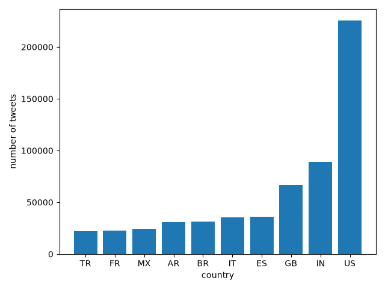
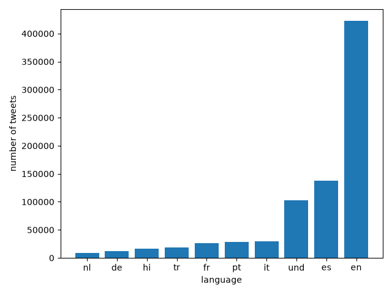
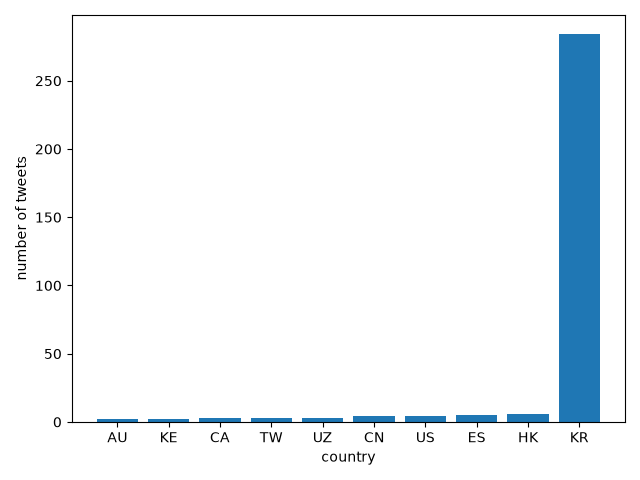
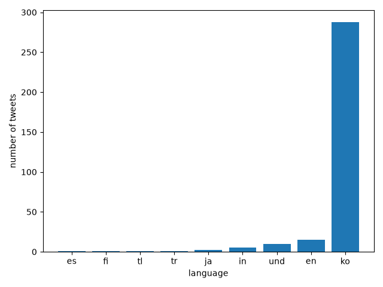
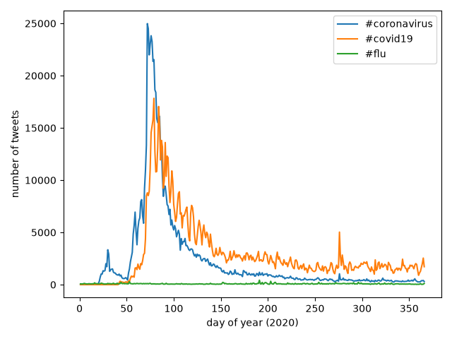

# Tracking COVID-19 Hashtags on Twitter in 2020

This project measures how coronavirus-related hashtags spread across languages and countries during 2020. The dataset is every geotagged tweet sent in 2020, about 1.1 billion tweets stored as 366 daily zip files (2020 was a leap year).

# How it Works

I used a MapReduce approach to process this data in parallel. `src/map.py` reads one day of tweets and counts how often each of the 17 hashtags appears, broken down by language and country. Tweets without a country code (for example, ones sent from international waters) are labeled `unknown` so the mapper doesn't crash. `run_maps.sh` runs the mapper on all 366 zip files at once using `&`, with `nohup` so the jobs keep running after logging out. This lets the days be processed simultaneously instead of one after another. `src/reduce.py` combines these results into yearly totals, and then `src/visualize.py` plots the top 10 languages and countries for a given hashtag.

# Results

The US led #coronavirus with about 225,000 tweets, followed by India with about 89,000 tweets, and in third place was the UK with about 67,000 tweets.

English was the most common language for #coronavirus at about 420,000 tweets, followed by Spanish at about 138,000. The `und` bar stands for "undetermined," Twitter's label for tweets whose language it couldn't detect.

The Korean hashtag #코로나바이러스 was much rarer in geotagged tweets. Almost all of its roughly 290 uses came from South Korea and were written in Korean.

# Hashtag usage over time

`src/alternative_reduce.py` keeps each day separate instead of summing them, then plots how many tweets used each hashtag on each day of the year. #coronavirus peaked at about 25,000 tweets a day in mid-March, right after the WHO declared a pandemic on March 11. From around late March onward, #covid19 overtook it as the more popular tag, with a short spike in early October. #flu stayed flat all year.

